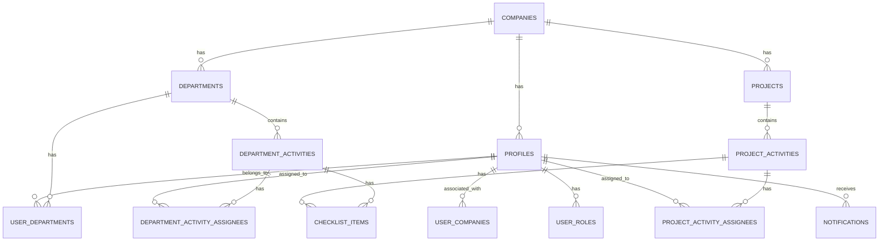

# Database Schema Documentation

This document describes the database schema used in the Vigil Watch Haven system. The system uses a mock database implementation for local development and testing.

## Table Structure

### 1. Companies
Stores information about organizations/companies in the system.

```javascript
{
  id: string,           // Unique identifier
  name: string,         // Company name
  created_at: string    // ISO timestamp
}
```

### 2. Departments
Represents different departments within a company.

```javascript
{
  id: string,           // Unique identifier
  company_id: string,   // Reference to company
  name: string,         // Department name
  description: string,  // Department description
  created_at: string    // ISO timestamp
}
```

### 3. Profiles
User profiles containing personal information.

```javascript
{
  id: string,           // Unique identifier (user ID)
  company_id: string,   // Reference to company
  full_name: string,    // User's full name
  role: string,         // User role (admin, gestor, colaborador)
  email: string,        // User email
  created_at: string    // ISO timestamp
}
```

### 4. User Companies
Associates users with companies and their roles.

```javascript
{
  id: string,           // Unique identifier
  user_id: string,      // Reference to user
  company_id: string,   // Reference to company
  role: string          // Role within company (admin, gestor, colaborador)
}
```

### 5. User Roles
Stores user roles within the system.

```javascript
{
  id: string,           // Unique identifier
  user_id: string,      // Reference to user
  role: string          // Role (admin, gestor, colaborador)
}
```

### 6. User Departments
Associates users with departments and specifies if they are managers.

```javascript
{
  id: string,           // Unique identifier
  user_id: string,      // Reference to user
  department_id: string,// Reference to department
  is_manager: boolean   // Whether user is department manager
}
```

### 7. Projects
Main projects in the organization.

```javascript
{
  id: string,                     // Unique identifier
  name: string,                   // Project name
  company_id: string,             // Reference to company
  description: string,            // Project description
  status: string,                 // Project status
  progress: number,               // Completion percentage
  total_activities: number,       // Total activities in project
  completed_activities: number,   // Number of completed activities
  start_date: string,             // ISO timestamp
  end_date: string,               // ISO timestamp
  created_at: string,             // ISO timestamp
  created_by: string              // User ID who created the project
}
```

### 8. Project Activities
Tasks/activities within projects.

```javascript
{
  id: string,           // Unique identifier
  project_id: string,   // Reference to project
  name: string,         // Activity name
  description: string,  // Activity description
  status: string,       // Activity status (nao_iniciado, pendente, em_andamento, concluida, cancelada)
  priority: string,     // Priority level
  deadline: string,     // ISO timestamp
  schedule_start: string,// ISO timestamp
  schedule_end: string, // ISO timestamp
  deadline_status: string,// Deadline status
  completed_at: string, // ISO timestamp when completed
  created_at: string,   // ISO timestamp
  created_by: string    // User ID who created the activity
}
```

### 9. Department Activities
Tasks/activities within departments.

```javascript
{
  id: string,           // Unique identifier
  department_id: string,// Reference to department
  name: string,         // Activity name
  description: string,  // Activity description
  status: string,       // Activity status (nao_iniciado, pendente, em_andamento, concluida, cancelada)
  priority: string,     // Priority level
  deadline: string,     // ISO timestamp
  schedule_start: string,// ISO timestamp
  schedule_end: string, // ISO timestamp
  deadline_status: string,// Deadline status
  completed_at: string, // ISO timestamp when completed
  created_at: string,   // ISO timestamp
  created_by: string    // User ID who created the activity
}
```

### 10. Project Activity Assignees
Associates users with project activities.

```javascript
{
  id: string,           // Unique identifier
  activity_id: string,  // Reference to project activity
  user_id: string       // Reference to user
}
```

### 11. Department Activity Assignees
Associates users with department activities.

```javascript
{
  id: string,           // Unique identifier
  activity_id: string,  // Reference to department activity
  user_id: string       // Reference to user
}
```

### 12. Notifications
System notifications for users.

```javascript
{
  id: string,           // Unique identifier
  title: string,        // Notification title
  description: string,  // Notification description
  type: string,         // Notification type
  created_by: string,   // User ID who created notification
  created_for: string,  // User ID notification is for
  task_id: string,      // Reference to task/activity
  project_id: string,   // Reference to project (optional)
  read: boolean,        // Whether notification has been read
  created_at: string,   // ISO timestamp
  updated_at: string    // ISO timestamp
}
```

### 13. Checklist Items
Checklist items for activities.

```javascript
{
  id: string,           // Unique identifier
  activity_id: string,  // Reference to activity
  text: string,         // Checklist item text
  completed: boolean,   // Whether item is completed
  created_at: string    // ISO timestamp
}
```

## Status Values

### Activity Status
- `nao_iniciado` - Not started
- `pendente` - Pending
- `em_andamento` - In progress
- `concluida` - Completed
- `cancelada` - Cancelled

### Priority Levels
- `urgente` - Urgent
- `media_urgencia` - Medium urgency
- `nao_urgente` - Not urgent

### Deadline Status
- `no_prazo` - On time
- `fora_do_prazo` - Overdue
- `concluido_no_prazo` - Completed on time
- `concluido_atrasado` - Completed late
- `bateu_meta` - Hit target

## Relationship Diagram

